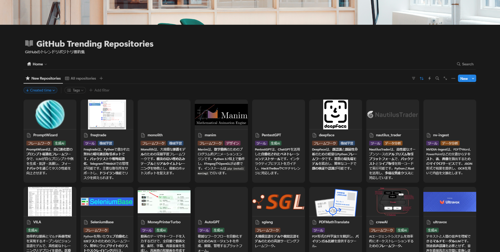
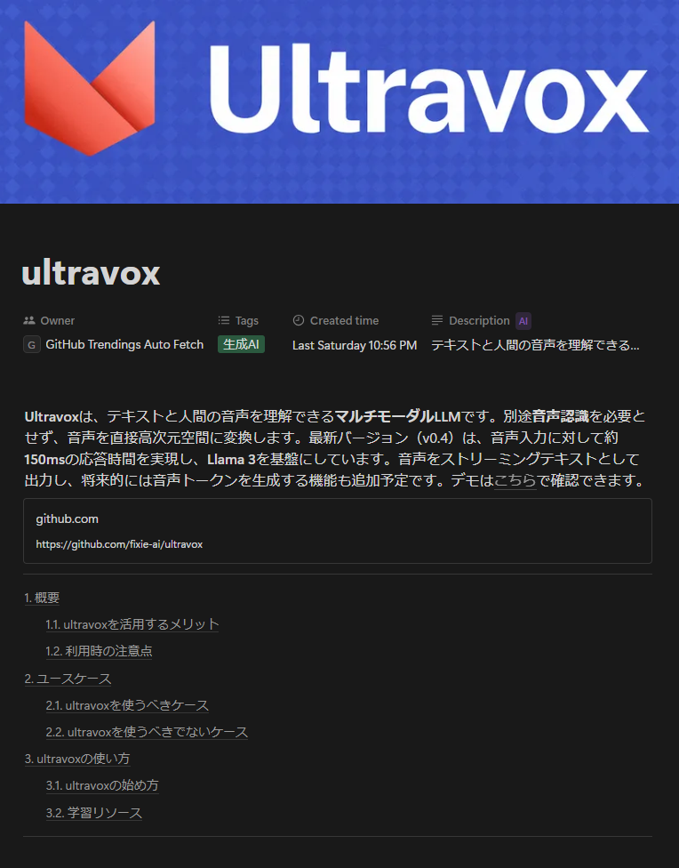

# GitHub Trending Repository Summarizer

GitHubのトレンドリポジトリを自動的に収集・要約・アーカイブするPythonスクリプト



## 💁 概要

このスクリプトは、GitHubのトレンドリポジトリの情報収集を効率化するためのスクリプトです。
具体的には、GitHubからトレンドリポジトリを収集し、生成AIを用いて要約した後、Notionのページに保存します。

すべてのリポジトリが同じフォーマットで要約された形で見れるようになるため、情報収集が大幅に効率化されます。また生成AIがリポジトリごとに具体的なユースケースを提案するため、リポジトリ活用の促進が期待されます。



## 🌠 機能

- GitHubのトレンドリポジトリのスクレイピング
- 生成AIによるREADMEの要約
- リポジトリのユースケースの自動生成
- リポジトリの内容に基づく自動タグ割り当て
- Notionへのページの自動生成

## 🚀 Quick Start

### 3.1. trending-repository-summarizerをインストール

Gitとuvをインストール済みの環境で、下記のコマンドを実行します。

```shell
$ git clone https://github.com/analytics-jp/trending-repository-summarizer
$ cd trending-repository-summarizer
$ uv sync
```

### 3.2. 環境変数の設定

`.env.template`ファイルをコピーし、`.env`という名前で保存します。

`.env`ファイルの中には、APIキーやNotionデータベースIDを記載する箇所があるので、
各々の環境に合わせて設定します。

### 3.3. 実行

Pythonスクリプトを実行するには、下記のコマンドを実行します。

```shell
$ uv run src/trending_repository_summarizer/main.py
```

スクリプトを実行すると、最新のトレンドリポジトリが収集され、要約された結果がNotionに保存されます。

## 📝 License

Copyright © 2025 Ryohei Machida

This project is [MIT](./LICENSE) licensed.
